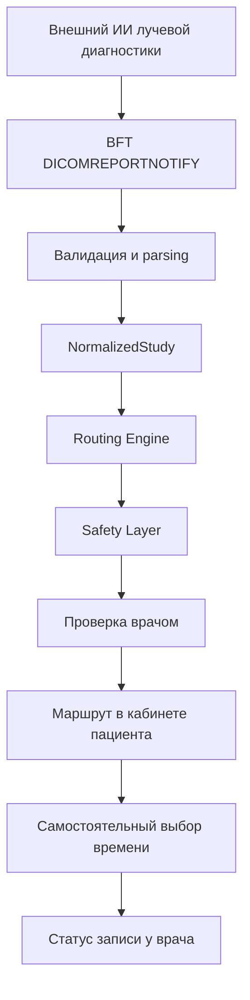

# «Третье мнение» — объяснимая маршрутизация после лучевой диагностики

**Команда «Элита» · Hackathon MVP · версия 1.4.0**

Работающий прототип объединяет два контура — кабинет врача и кабинет
пациента. Он принимает уже готовый структурированный результат внешнего ИИ
лучевой диагностики, формирует объяснимый черновик следующего шага, проверяет
его через Safety Layer и передаёт пациенту только после решения врача.

> Система не ставит диагноз, не анализирует медицинские изображения
> самостоятельно и не заменяет врача. В MVP используются исключительно
> синтетические данные.

## Быстрые ссылки

- **[Публичный кабинет врача](https://third-opinion-routing.onrender.com/)**
- **[Публичный кабинет пациента](https://third-opinion-routing.onrender.com/patient)**
- [Публичный Swagger / OpenAPI](https://third-opinion-routing.onrender.com/docs)
- [Публичный health check](https://third-opinion-routing.onrender.com/health)
- Кабинет врача локально: <http://localhost:8000/>
- Кабинет пациента локально: <http://localhost:8000/patient>
- Swagger / OpenAPI: <http://localhost:8000/docs>
- Health check: <http://localhost:8000/health>
- [Архитектура](docs/ARCHITECTURE_RU.md)
- [Сценарная валидация](docs/SCENARIO_VALIDATION_RU.md)

Публичная демонстрация развёрнута на бесплатном тарифе Render. После периода
бездействия первый запуск может занять около минуты.

## Проблема (Problem)

После КТ, рентгенографии или маммографии пациент получает результат
исследования, но может не понимать, что делать дальше. Он откладывает повторный
приём, не доходит до профильного специалиста или прекращает взаимодействие с
клиникой. Врачам при этом приходится вручную разбирать результаты и объяснять
следующий организационный шаг.

Существующий диагностический ИИ помогает получить находку или заключение, но
сам по себе не замыкает путь от результата исследования до осознанного действия
пациента.

## Решение (Solution)

«Третье мнение» добавляет безопасный post-AI контур:

1. принимает структурированный результат внешнего диагностического ИИ;
2. нормализует находки из structured fields, описания и заключения;
3. формирует детерминированный черновик маршрута;
4. показывает правило, источник и причины решения;
5. блокирует сомнительный результат через Safety Layer;
6. оставляет финальное решение за врачом;
7. после подтверждения предлагает пациенту самостоятельно выбрать дату и время;
8. возвращает врачу статус записи пациента.

Врач определяет медицинский следующий шаг. Пациент самостоятельно выбирает
удобный временной интервал.

## Пользовательские сценарии (User Scenario)

### Контур врача — B2B

1. Врач выбирает синтетическое исследование или получает структурированный
   результат через API.
2. Система показывает находку, приоритет, рекомендуемого специалиста и срок.
3. Врач проверяет Safety Layer и цепочку прослеживаемости.
4. При необходимости врач раскрывает исходное описание и заключение.
5. Врач подтверждает рекомендованный маршрут либо выбирает повторную
   консультацию.

Врач не назначает пациенту конкретную дату и время.

### Контур пациента — B2C

1. После решения врача в кабинете появляется уведомление и подтверждённый
   маршрут.
2. Пациент видит понятный следующий шаг и доступные интервалы.
3. Пациент самостоятельно выбирает дату и время.
4. Статус **«Пациент записался»** возвращается в кабинет врача.

## Как это работает (How It Works)



Все переходы после результата ИИ выполняются локально и воспроизводимо. Для
основного демонстрационного сценария не требуются внешние API или генеративная
модель.

## Входные данные (Input Data)

MVP использует десять полностью синтетических сообщений. Они имитируют
контракт BFT `DICOMREPORTNOTIFY` и включают:

- идентификаторы исследования и серии;
- `aiResult.report` и `aiResult.conclusion`;
- `pathologyFlag`, `norma`, `confidenceLevel`;
- modality-specific блоки `probParams`;
- идентификатор и версию внешней модели;
- согласованные и намеренно конфликтующие примеры.

Синтетические `studyIUID` начинаются с `1.2.643.demo.`. Реальные данные
пациентов в репозитории отсутствуют и не должны загружаться в прототип.

## DICOM SR / Kafka Integration

В целевой схеме источник публикует BFT-сообщение `DICOMREPORTNOTIFY`, связанное
с результатом лучевой диагностики. В MVP реализованы строгая Pydantic-схема
этого сообщения и endpoint приёма payload.

Live Kafka broker и полноценный DICOM SR consumer не входят в MVP. Их место
занимает воспроизводимый demo adapter с тем же прикладным контрактом. Поэтому
интеграционный транспорт можно заменить без изменения parsing, routing и
safety-логики.

## Архитектура (Architecture)

Основные слои:

| Слой | Назначение |
| --- | --- |
| Adapters | Загрузка и проверка синтетических BFT-сообщений |
| Models | Строгие входные, внутренние и API-контракты |
| Parsers | Определение модальности, structured/text parsing, нормализация |
| Routing | Детерминированные правила следующего шага |
| Safety | Fail-closed проверки конфликтов, уверенности и red flags |
| Services | Оркестрация анализа и записи пациента |
| Persistence | История, решения врача и запись в SQLite |
| API | Версионированные REST endpoints и OpenAPI |
| Frontend | Связанные кабинеты врача и пациента |

Подробная схема компонентов, состояний и границ MVP находится в
[`docs/ARCHITECTURE_RU.md`](docs/ARCHITECTURE_RU.md).

## Routing Engine

Routing Engine не угадывает диагноз и не обращается к LLM. Он применяет
явные, проверяемые правила к нормализованным находкам.

Примеры:

| Находка | Черновик маршрута | Приоритет |
| --- | --- | --- |
| Очаговое образование лёгкого | Пульмонолог, в течение 14 дней | Priority |
| Маммография BI-RADS 4–5 | Маммолог / онколог-маммолог, в течение 14 дней | Priority |
| Возможный пневмоторакс | Дежурный врач / торакальный хирург, в тот же день | Urgent |
| BI-RADS 2 | Плановое наблюдение по решению врача | Routine |
| Неподдерживаемая находка | Ручная проверка без угадывания маршрута | Manual review |

Каждый результат остаётся `DRAFT_FOR_REVIEW` и требует участия врача.

## Safety Layer

Safety Layer работает отдельно от Routing Engine и использует fail-closed
подход. Он проверяет:

- низкую уверенность для значимой находки;
- конфликт structured fields, описания и заключения;
- конфликт `pathologyFlag` и `norma`;
- неизвестную модальность;
- отсутствие валидированного правила;
- несовпадение исследования и маршрута;
- клинический red flag;
- обязательность врачебного подтверждения.

Возможные результаты:

- `CLEARED_FOR_REVIEW` — черновик можно показать врачу;
- `ESCALATE_TO_CLINICIAN` — требуется срочное внимание врача;
- `BLOCKED_PENDING_REVIEW` — продолжение сценария заблокировано.

Даже `CLEARED_FOR_REVIEW` не разрешает автоматическое уведомление пациента.

## Прослеживаемость (Traceability)

Для маршрута сохраняются:

1. исходный payload;
2. путь к исходному полю, например `aiResult.probParams.ct_lc`;
3. нормализованная находка;
4. идентификатор правила;
5. обоснование, приоритет и срок;
6. результат Safety Layer;
7. решение врача и дальнейший статус пациента.

В интерфейсе врача исходные описание и заключение раскрываются непосредственно
из цепочки решения.

## Технологии (Tech Stack)

- Python 3.13;
- FastAPI и Pydantic;
- Uvicorn;
- SQLite;
- HTML, CSS и vanilla JavaScript;
- Pytest и HTTPX;
- Docker и Docker Compose;
- Render Blueprint для публичного demo.

## Структура репозитория (Repository Structure)

```text
third-opinion-routing/
├── backend/
│   ├── app/
│   │   ├── adapters/
│   │   ├── api/
│   │   ├── models/
│   │   ├── parsers/
│   │   ├── persistence/
│   │   ├── routing/
│   │   ├── safety/
│   │   ├── services/
│   │   └── main.py
│   ├── scripts/
│   ├── tests/
│   └── requirements.txt
├── data/demo/
├── docs/
├── frontend/
├── .env.example
├── Dockerfile
├── compose.yaml
├── render.yaml
└── README.md
```

## Установка (Installation)

### Windows PowerShell

```powershell
cd backend
python -m venv .venv
.\.venv\Scripts\python.exe -m pip install -r requirements.txt
```

### Linux / macOS

```bash
cd backend
python3 -m venv .venv
.venv/bin/python -m pip install -r requirements.txt
```

## Локальный запуск без Docker (Running Locally)

Windows PowerShell из папки `backend`:

```powershell
$env:DATABASE_PATH="..\data\third_opinion.sqlite3"
.\.venv\Scripts\python.exe -m uvicorn app.main:app --reload
```

Linux / macOS:

```bash
DATABASE_PATH=../data/third_opinion.sqlite3 \
  .venv/bin/python -m uvicorn app.main:app --reload
```

После запуска открыть <http://localhost:8000/>.

## Docker

Из корня проекта:

```bash
docker compose up --build
```

Остановка:

```bash
docker compose down
```

Локальный Compose публикует сервис только на `127.0.0.1:8000` и хранит
синтетическую SQLite-историю в named volume `third_opinion_data`.

## API

Основные endpoints:

| Метод | Путь | Назначение |
| --- | --- | --- |
| GET | `/health` | Проверка готовности и версии |
| GET | `/api-info` | Адреса интерфейсов и документации |
| GET | `/api/v1/demo-cases` | Список синтетических сценариев |
| POST | `/api/v1/demo-cases/{case_id}/analyze` | Полный анализ demo case |
| POST | `/api/v1/analyze` | Обработка валидного BFT payload |
| GET | `/api/v1/analyses` | История исследований |
| GET | `/api/v1/analyses/{analysis_id}` | Результат и traceability |
| POST | `/api/v1/analyses/{analysis_id}/review` | Решение врача |
| GET | `/api/v1/analyses/{analysis_id}/care-journey` | Маршрут пациента |
| POST | `/api/v1/analyses/{analysis_id}/book` | Запись, выбранная пациентом |
| POST | `/api/v1/demo/reset` | Очистка только синтетической истории |

Полные схемы запросов и ответов доступны в Swagger: `/docs`.

## Демонстрационные сценарии (Demo Scenarios)

В набор входят 10 случаев:

- нормальное КТ ОГК;
- очаговое образование лёгкого;
- потенциальный пневмоторакс;
- маммография BI-RADS 2;
- маммография BI-RADS 4;
- низкая уверенность;
- конфликт `pathologyFlag` и `norma`;
- неизвестная модальность;
- отсутствие обязательного `aiResult`;
- конфликт structured data и заключения.

## Тестирование (Tests)

Полный набор:

```powershell
cd backend
.\.venv\Scripts\python.exe -m pytest -q
```

Текущий результат: **137 passed**.

Отдельная воспроизводимая проверка clinical-style сценариев:

```powershell
.\.venv\Scripts\python.exe -m scripts.validate_scenarios
```

Текущий результат: **Scenario validation: 4/4 passed**.

Подробная методика и ограничения описаны в
[`docs/SCENARIO_VALIDATION_RU.md`](docs/SCENARIO_VALIDATION_RU.md).

## Медицинская безопасность (Medical Safety)

- Сервис не ставит диагноз.
- Маршрут является только черновиком.
- Автоматическое уведомление пациента до решения врача запрещено.
- Критические признаки эскалируются врачу.
- Противоречивые и неподдерживаемые данные блокируются.
- В MVP используются только синтетические данные.
- Диагностическая точность внешнего ИИ не заявляется и не измеряется.

## Ограничения (Limitations)

- Нет анализа DICOM-изображений собственной нейросетью.
- Нет live Kafka broker и промышленного DICOM SR consumer.
- Нет интеграции с МИС/РИС/PACS и реальным расписанием клиники.
- Нет регистрации, аутентификации и ролевой модели.
- SQLite предназначена для демонстрации, а не production-нагрузки.
- Временные интервалы записи синтетические.
- Правила требуют клинической и организационной валидации до внедрения.
- Сценарные тесты не являются клиническим исследованием.
- Бесплатный Render может засыпать и терять временное состояние SQLite.

## Интеграция с клиникой (Clinic Integration)

Целевая интеграция предусматривает:

1. получение результата из существующего ИИ-контура клиники;
2. адаптер Kafka/DICOM SR;
3. сопоставление с идентификаторами исследования в РИС/PACS;
4. клинически согласованный каталог routing rules;
5. передачу подтверждённого маршрута в МИС;
6. подключение реального расписания и уведомлений;
7. аудит действий и выполнение требований к защите данных.

## Бизнес-ценность (Business Value)

Прототип сокращает разрыв между готовым результатом исследования и следующим
действием пациента. Потенциальная ценность для клиники:

- более понятный пациенту маршрут;
- снижение доли потерянных следующих шагов;
- поддержка повторной обращаемости;
- снижение ручной организационной нагрузки;
- прозрачный контроль статусов;
- повышение полезности уже внедрённого диагностического ИИ.

Эти эффекты являются проверяемыми гипотезами MVP. Проект не выдаёт их за
измеренные производственные показатели.

## Дальнейшее развитие (Future Development)

- пилот на обезличенной клинической выборке;
- экспертная проверка routing rules;
- интеграция Kafka, DICOM SR, МИС/РИС/PACS;
- PostgreSQL и production-аудит;
- аутентификация и разграничение ролей;
- реальное расписание клиники;
- уведомления пациента;
- локализация и accessibility-аудит;
- концепт интерактивной 3D-визуализации проблемной зоны пациента.

## Команда (Team)

**«Элита»**. Имена участников не публикуются в открытом репозитории.

## Лицензирование и статус

Проект создан как hackathon MVP. Медицинские правила, демонстрационные данные
и интерфейс не предназначены для применения в реальной клинической практике
без отдельной валидации, юридической оценки и интеграционных испытаний.
