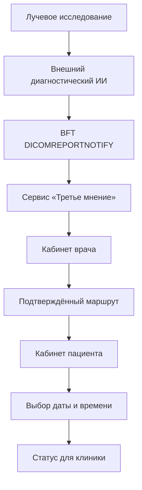
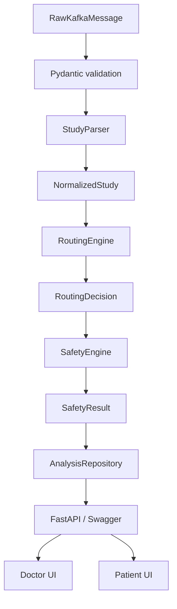
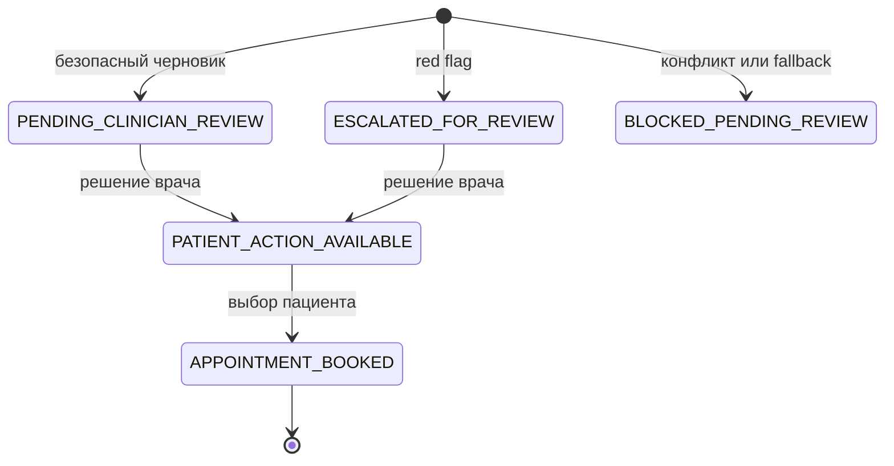
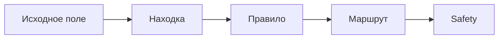

# Архитектура MVP «Третье мнение»

## Контекст решения

Прототип находится после существующего ИИ лучевой диагностики. Он не получает
изображение и не повторяет диагностический inference. Его задача — безопасно и
объяснимо превратить готовый структурированный результат в проверяемый
черновик следующего организационного шага.

## Внутренние компоненты

| Компонент | Путь | Ответственность |
| --- | --- | --- |
| Demo adapter | `backend/app/adapters` | Загрузка 10 синтетических payload |
| Input contracts | `backend/app/models/kafka.py` | BFT envelope и `aiResult` |
| Parsers | `backend/app/parsers` | Modality, structured/text parsing, нормализация |
| Routing engine | `backend/app/routing` | Явные правила следующего шага |
| Safety layer | `backend/app/safety` | Блокировка, эскалация, fail-closed проверки |
| Orchestration | `backend/app/services` | Порядок pipeline и booking logic |
| Persistence | `backend/app/persistence` | SQLite, история, review, booking |
| REST API | `backend/app/api` | Версионированные endpoints |
| Frontend | `frontend` | Кабинеты врача и пациента |

## Порядок анализа

1. Pydantic отвергает повреждённый контракт до маршрутизации.
2. `StudyParser` определяет модальность и строит `NormalizedStudy`.
3. Structured findings сохраняют ссылки на исходные поля.
4. Text parser выделяет утверждение, отрицание и неопределённость.
5. `RoutingEngine` выбирает только заранее определённое правило.
6. `SafetyEngine` независимо проверяет вход и решение.
7. Репозиторий сохраняет raw input, normalized result, route и safety result.
8. Врач принимает финальное решение.
9. Только после review пациенту становится доступно действие.

## Состояния workflow

`BLOCKED_PENDING_REVIEW` не переходит к пациенту в рамках MVP. Для продолжения
нужна отдельная ручная проверка и устранение причины блокировки.

## Прослеживаемость

Для каждого шага сохраняются идентификатор стадии, описание и evidence paths.
Это позволяет показать врачу не только результат, но и основание решения.

## Границы безопасности

- Внешний диагностический ИИ является отдельным upstream-компонентом.
- Наш сервис не заявляет диагностическую точность.
- Routing rules детерминированы и доступны для аудита.
- Safety Layer не разрешает обход врачебного подтверждения.
- Пациент не может получить неподтверждённый маршрут.
- Врач не выбирает за пациента дату и время.
- Все demo payload синтетические.

## Хранение данных

Локально используется SQLite. Docker Compose подключает named volume, поэтому
синтетическая история сохраняется между обычными перезапусками контейнера.
Бесплатный Render использует временную SQLite-базу: состояние может исчезнуть
после сна, рестарта или redeploy. Кнопка **«Сбросить демо»** очищает только
синтетические записи и care journeys.

## Production-направление

Для внедрения необходимо заменить demo adapter на интеграционный consumer,
согласовать mapping DICOM SR/BFT, вынести хранение в промышленную СУБД,
подключить МИС/РИС/PACS, внедрить аутентификацию, аудит и мониторинг, а также
провести клиническую, информационно-безопасностную и юридическую валидацию.
